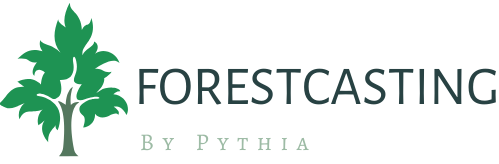
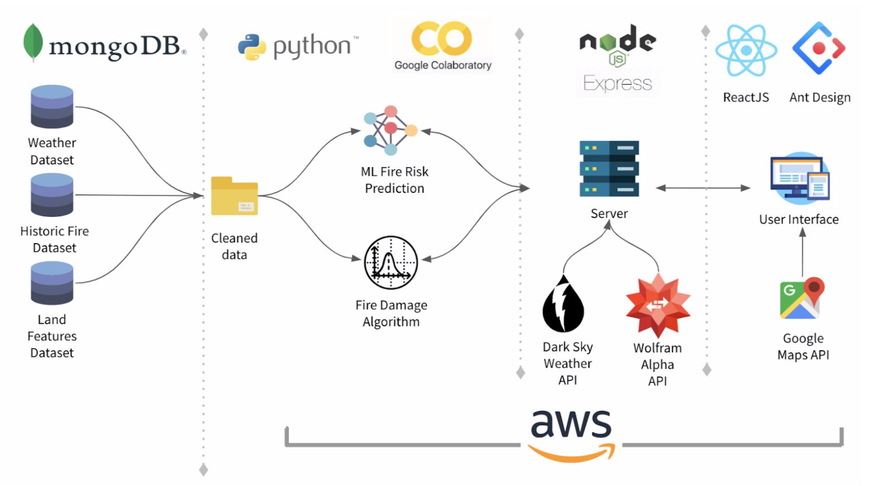

---

_Winner of the 2020 Ontario-Wide Software Engineering Capstone Competition_ 🏆

## About

Forestcasting is a forest fire management tool that provides vital information to aid fire fighting resource allocation. The Forestcasing tool consists of a machine learning model that calculates the probability a forest fire could occur in a given area, and a mathematical damage algorithm that estimates the severity of damages caused by said fire. Forestcasting’s results give forest fire managers the tools and data required to take appropriate precautions.

## How it looks

## Design and Implementation

All design and implementation details including information on data gathering, data pipelines and processing, machine learning tuning and metrics can be found inside the [Final Report](assets/FinalReport.pdf).

Specifically:

-   Page 24-38 Software Design Specification
-   Page 41-48 Implementation

## Repository Layout

-   The fire risk model and damage algorithm were built and tuned on Google Colab, the notebooks have been exported as Python scripts into this repository ([damage-alg-notebooks](https://github.com/ivanzvonkov/forestcasting/tree/master/damage-alg-notebooks) and [fire-prediction-notebooks](https://github.com/ivanzvonkov/forestcasting/tree/master/fire-prediction-notebooks)).
-   The model was deployed as a separate API ([ML](https://github.com/ivanzvonkov/forestcasting/tree/master/ML)) while the damage algorithm was directly integrated into the NodeJS [backend](https://github.com/ivanzvonkov/forestcasting/tree/master/backend).
-   Lastly, the user interface is coded in ReactJS and can be found in the [frontend](https://github.com/ivanzvonkov/forestcasting/tree/master/frontend) folder.

See diagram below for architecture and technology stack information:

## Authors

-   [Samantha Campbell](https://github.com/scamp94) - Data Science and Backend
-   [Shima Kananitodashki](https://github.com/skananit) - Data Science and Frontend
-   [Tharmiga Loganathan](https://github.com/tharmigaloganathan) - Data Science and Backend
-   [Ivan Zvonkov](https://github.com/ivanzvonkov) - Data Science and Machine Learning
